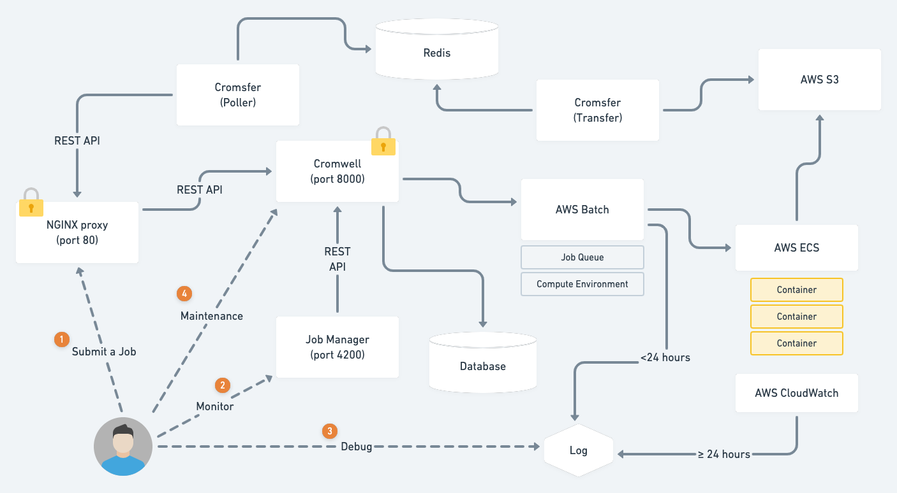
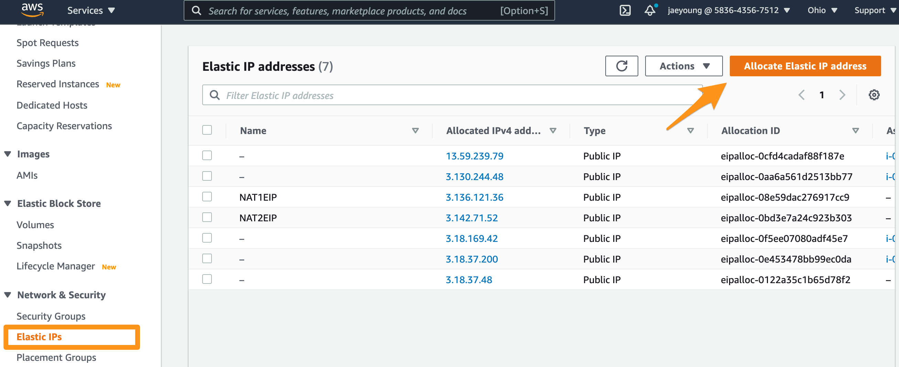
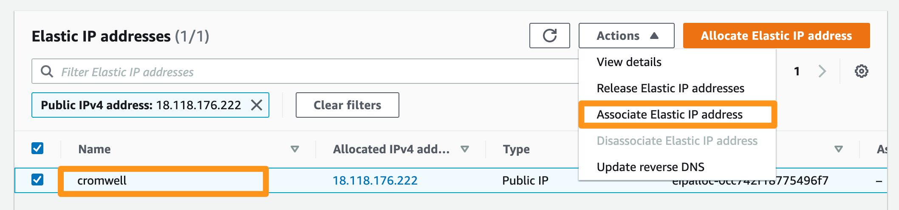
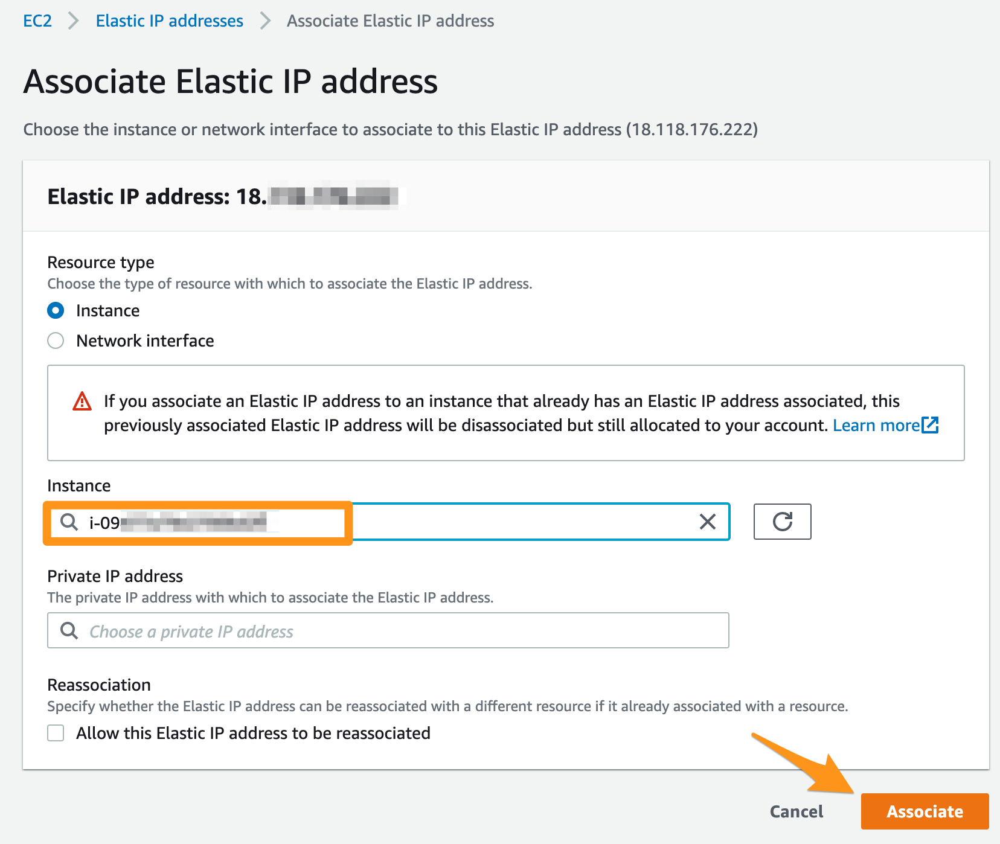
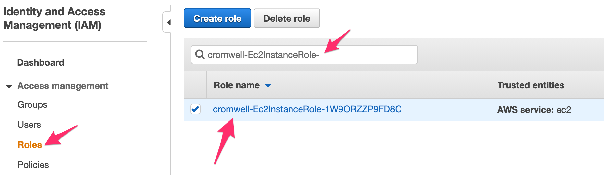

# cromwell-gwf-setup

Setting Up AWS GWF (Genomics Workflowss) + Cromwell



## Create a New VPC

Create a new VPC using the CloudFormation template here: https://console.aws.amazon.com/cloudformation/home?#/stacks/new?stackName=GenomicsVPC&templateURL=https://aws-quickstart.s3.amazonaws.com/quickstart-aws-vpc/templates/aws-vpc.template.yaml

## Deploy Genomics Workflow Core

Create a Genomics Workflow Core using the CloudFormation templete here: https://console.aws.amazon.com/cloudformation/home?#/stacks/new?stackName=gwfcore&templateURL=https://aws-genomics-workflows.s3.amazonaws.com/latest/templates/gwfcore/gwfcore-root.template.yaml

Follow the instructions in the section called `Deployment of Genomics Workflow Core into an existing VPC` which can be found [here](./docs/cloudformation/Installing-the-Genomics-Workflow-Core-and-Cromwell.pdf).

The pre-downloaded template can be found in the `cloudformation` directory.

## Deploy Cromwell Resources

Create a Cromwell server instance and and and RDS Aurora Serverless database cluster using the CloudFormation template here: https://console.aws.amazon.com/cloudformation/home?#/stacks/new?stackName=cromwell-resources&templateURL=https://aws-genomics-workflows.s3.amazonaws.com/latest/templates/cromwell/cromwell-resources.template.yaml

- Make sure that the value for `GWFCoreNamespace` you put in this template must be matched with the value you set when you created a Genomics Workflow Core in the section above.
- If you are deploying multiple instances of GWF/Cromwell, make sure that the value for `Namespace` you put in this template is unique across all regions (us-east-1, us-west-1, ...)

Follow the instructions in the section called `Deploy Cromwell Resources` which can be found [here](./docs/cloudformation/Installing-the-Genomics-Workflow-Core-and-Cromwell.pdf).

The pre-downloaded template can be found in the `cloudformation` directory.

Once the Cromwell server EC2 instance is created, SSH into it using the web-based "EC2 Instance Connect" tool in the AWS Management Console. Use the username `ec2-user` (no password required). This is the only way to connect at the moment because CloudFormation does not associate a key pair when creating the Cromwell server instance.


To use your existing key pair (.pem) to connect to this instance, first retrieve the public key for your key pair: https://docs.aws.amazon.com/AWSEC2/latest/UserGuide/ec2-key-pairs.html#retrieving-the-public-key

Then, SSH into the Cromwell server instance and add the public key to the authorized keys ():

```
$ echo 'ssh-rsa AAAAB3NzaC1yc2EAAA...PLE' >> /home/ec2-user/.ssh/authorized_keys
```

Helpful article: https://aws.amazon.com/premiumsupport/knowledge-center/user-data-replace-key-pair-ec2/

## Prerequisites

SSH into the Cromwell server instance and install the following software.

### Install Python 3

Skip this section if the recent AMI comes with Python 3.

```bash
$ sudo yum install python36
$ cd /usr/bin/
$ sudo ln -s pip-3.6 pip3
```

### Install Docker

```bash
$ sudo yum install -y docker
$ sudo service docker start
$ sudo usermod -a -G docker ec2-user
```

Log out, log back in. Check Docker is properly installed by running:

```bash
$ docker
```

### Install Docker Compose

Install docker-compose (https://docs.docker.com/compose/install/#install-compose):

```bash
$ sudo curl -L "https://github.com/docker/compose/releases/download/1.29.1/docker-compose-$(uname -s)-$(uname -m)" -o /usr/local/bin/docker-compose
$ sudo chmod +x /usr/local/bin/docker-compose
```

Check Docker Compose is properly installed by running:

```bash
$ docker-compose
```

## Install Job Manager

The latest version can be found here: https://github.com/DataBiosphere/job-manager/releases

You will be asked a series of questions. Enter `v1.5.7` for the Job Manager version (latest as of April 2021). You can use default values for the rest of the questions.

```bash
$ cd ~
$ curl -s https://raw.githubusercontent.com/DataBiosphere/job-manager/master/deploy/quickstart/quick_start.py > /tmp/jmui.py && python3 /tmp/jmui.py

>> Select a version [ v0.3.0 ] > v1.5.7

>> Select an installation directory [ /home/ec2-user/jmui ] >
Using: /home/ec2-user/jmui
Creating directory: /home/ec2-user/jmui

That directory already exists... I can...
1. Default: Re-use the existing directory which might leave behind some old files
2. Delete the entire directory and all of its contents - and then remake it, completely empty

Re-use or replace? (1/2) [ 1 ] > 2
Removing /home/ec2-user/jmui and its subdirectories
Creating a new directory at /home/ec2-user/jmui
Creating directory: /home/ec2-user/jmui/bin
Creating directory: /home/ec2-user/jmui/config

>> Select a shim to use (Cromwell/dsub) [ Cromwell ] >
Using: Cromwell


>> Enter the Cromwell URL [ http://addr:172.17.0.1:8000/api/workflows/v1 ] >

>> Setting up for single-instance or against Caas? (instance/caas) [ instance ] >
Using: instance

To start, run:
> /home/ec2-user/jmui/bin/jmui_start.sh
```

## Configure Network Settings

### Assign Elastic IP

Assign an Elastic IP address to the Cromwell server instance. The IP address assigned here will be used in the later section.







### Cromwell Server

Make sure the listening port is set to `8000` and the server binds to all interfaces (i.e. `0.0.0.0`).

```bash
$ nano ~/cromwell.conf
```

BEFORE:

```
webservice {
  interface = localhost
  port = 8000
}
```

AFTER:

```
webservice {
  interface = 0.0.0.0
  port = 8000
}
```

### AWS Security Group

Choose `Security Groups`, start tyyping `cromwell-server-sg` in the search box, and choose the security group whose name starts with `cromwell-server-sg`.


Add TCP port `4200` to the cromwell-server security group to allow inbound traffic for Job Manager.


### NGINX

Make sure the listening port is set to `80`, and turn off SSL by commenting out the three lines as shown below:

```bash
$ sudo nano /etc/nginx/nginx.conf
```

BEFORE:

```
...
       	listen       80 default_server;
       	listen       443 ssl http2;
        listen       [::]:443 ssl http2;

       	# redirect all non-ssl traffic to ssl
        if ($ssl_protocol = "") {
          rewrite ^ https://$host$request_uri? permanent;
        }
...
```

AFTER:

```
...
       	listen       80 default_server;
       	listen       443 ssl http2;
        listen       [::]:443 ssl http2;

       	# redirect all non-ssl traffic to ssl
#        if ($ssl_protocol = "") {
#          rewrite ^ https://$host$request_uri? permanent;
#        }
...
```

To add basic authentication, please refer to this article: https://docs.nginx.com/nginx/admin-guide/security-controls/configuring-http-basic-authentication/

Replace `user2`, `user3`, ... to actual user names.

```bash
$ sudo yum install httpd-tools
$ sudo mkdir /etc/apache2
$ sudo htpasswd -c /etc/apache2/.htpasswd user1
$ sudo htpasswd /etc/apache2/.htpasswd user2
$ sudo htpasswd /etc/apache2/.htpasswd user3
```

Configure the NGINX to use Basic Authentication:

```bash
$ sudo nano /etc/nginx/nginx.conf
```

AFTER:

```
...
        location / {
            proxy_pass            http://localhost:8000;
            auth_basic            "restricted area";
            auth_basic_user_file  /etc/apache2/.htpasswd;
        }
...
```

Reload the modified NGINX configuration:

```bash
$ sudo systemctl reload nginx
```

## Update IAM Role

Look for IAM role whose name starts with `cromwell-Ec2InstanceRole-`.



Give all S3 permission to every bucket. This is necessary if your input files to workflow is stored in other S3 buckets.

BEFORE:

```json
{
    "Version": "2012-10-17",
    "Statement": [
        {
            "Action": [
                "s3:*"
            ],
            "Resource": [
                "arn:aws:s3:::dp-lab-gwf-core",
                "arn:aws:s3:::dp-lab-gwf-core/*"
            ],
            "Effect": "Allow"
        },
        {
            "Action": [
                "s3:ListBucket",
                "s3:ListAllMyBuckets"
            ],
            "Resource": "*",
            "Effect": "Allow"
        },
        {
            "Action": [
                "s3:GetObject",
                "s3:ListBucket"
            ],
            "Resource": [
                "arn:aws:s3:::gatk-test-data/*",
                "arn:aws:s3:::broad-references/*"
            ],
            "Effect": "Allow"
        }
    ]
}
```

AFTER:

```json
{
    "Version": "2012-10-17",
    "Statement": [
        {
            "Action": [
                "s3:*"
            ],
            "Resource": [
                "*"
            ],
            "Effect": "Allow"
        },
        {
            "Action": [
                "s3:GetObject",
                "s3:ListBucket"
            ],
            "Resource": [
                "arn:aws:s3:::gatk-test-data/*",
                "arn:aws:s3:::broad-references/*"
            ],
            "Effect": "Allow"
        }
    ]
}
```

## Change Job Queue to Priority Queue

Open `cromwell.conf` and change `job-queue/default-gwf-core` to `job-queue/priority-gwf-core`. Using the priority queue will ensure that jobs submitted to AWS Batch will not use spot instances.

```
...
backend {
  default = "AWSBATCH"
  providers {
    AWSBATCH {
      actor-factory = "cromwell.backend.impl.aws.AwsBatchBackendLifecycleActorFactory"
      config {
        numSubmitAttempts = 10
        numCreateDefinitionAttempts = 10
        root = "s3://dp-lab-gwf-core/cromwell-execution"
        auth = "default"
        default-runtime-attributes { queueArn = "arn:aws:batch:us-east-1:583643567512:job-queue/priority-gwf-core" , scriptBucketName = "dp-lab-gwf-core" }
        filesystems {
          s3 {
            auth = "default"
            duplication-strategy: [
              "hard-link", "soft-link", "copy"
            ]
          }
        }
      }
    }
  }
}
...
```

## Download the Setup Package

SSH into the Cromwell server EC2 instance. Run the following command to download the setup package (the repository must be publicly accessible):

```bash
wget https://github.com/hisplan/cromwell-gwf-setup/archive/refs/tags/v0.1.13.tar.gz
```

If the setup package is in private repository, use the following command instead. Replace `xyz-123-abc` with your own GitHub token:

```bash
curl -L -o cromwell-gwf-setup-0.1.13.tar.gz  -H "Authorization: token xyz-123-abc"  https://github.com/hisplan/cromwell-gwf-setup/archive/refs/tags/v0.1.13.tar.gz
```

Decompress:

```bash
tar xvzf cromwell-gwf-setup-0.1.13.tar.gz --strip-components=1
```

## Install Redis and Cromsfer

Run the following command to install Redis and Cromsfer:

```bash
$ ./install.sh
```

## Configure Cromsfer

```bash
$ mkdir -p ./cromsfer
$ cp ./config/cromsfer/config.template.yaml ./cromsfer/config.yaml
```

Open the `./cromsfer/config.yaml` file and replace `ec2-w-x-y-z.compute-1.amazonaws.com` with the actual public IPv4 DNS name of the Cromwell server EC2 instance. The `user1` password must match with the password you set up for NGINX Basic Authentication.

```yaml
cromwell:
  url: http://ec2-w-x-y-z.compute-1.amazonaws.com
  username: user1
  password: 123
redis:
  host: ec2-w-x-y-z.compute-1.amazonaws.com
  port: 6379
```

## Configure Job Manager UI

```bash
$ cp ./config/job-manager/capabilities-config.json ./jmui/bin/capabilities-config.json
```

## Add Larger EC2 Instance Types

The default CloudFormation does not come up with larger EC2 instance types. To add additional larger EC2 instance types, refer to this document [here](./docs/add-larger-instance-types/README.md).

## Start/Stop Cromwell Server

If this is the first time, manually stop the Cromwell server instance and use the following command to start the server again.

To bring up the server, run the following from your local machine:

```bash
$ ./server.sh -u -i i-09477a79e2700bd2f -k ~/mykey.pem -r us-east-1
```

```
{
    "StartingInstances": [
        {
            "CurrentState": {
                "Code": 0,
                "Name": "pending"
            },
            "InstanceId": "i-0ca914341b4913d6c",
            "PreviousState": {
                "Code": 80,
                "Name": "stopped"
            }
        }
    ]
}
Cromwell server address: ec2-w-x-y-z.compute-1.amazonaws.com
Redirecting to /bin/systemctl start docker.service
Starting up Redis...
Backing up Cromwell Server Log...
Starting up Cromwell Server...
Waiting for Cromwell Server to be up and running...
Waiting for Cromwell Server to be up and running...
Starting up Job Manager...
DONE.
Cromwell/Job Manager is available at http://ec2-w-x-y-z.compute-1.amazonaws.com:4200
```

To bring down the server, run the following from your local machine:

```bash
$ ./server.sh -d -i i-09477a79e2700bd2f -k ~/mykey.pem -r us-east-1
```

## Test Workflow

Follow the [instructions here](test-workflow/README.md) and submit a test workflow.
