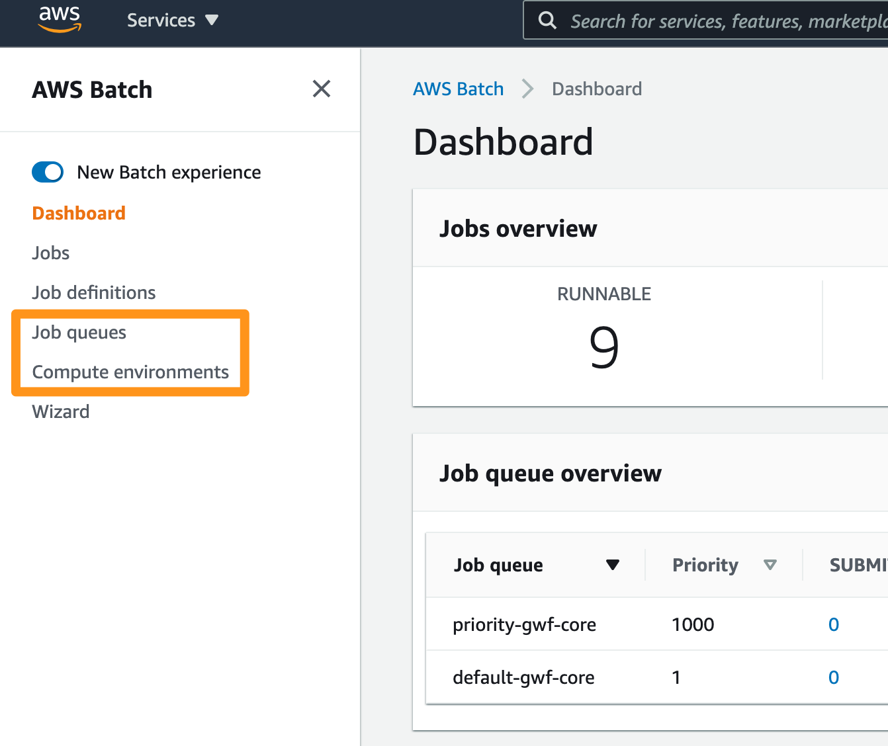
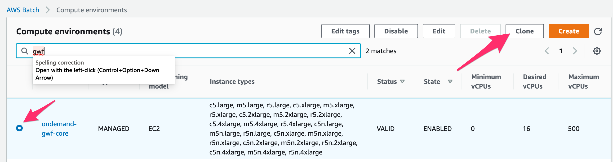
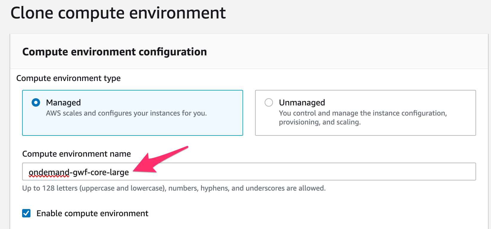
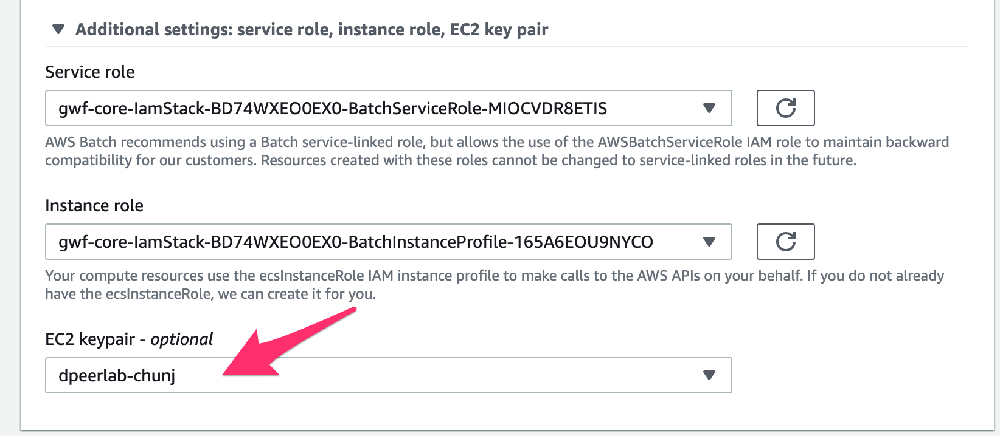
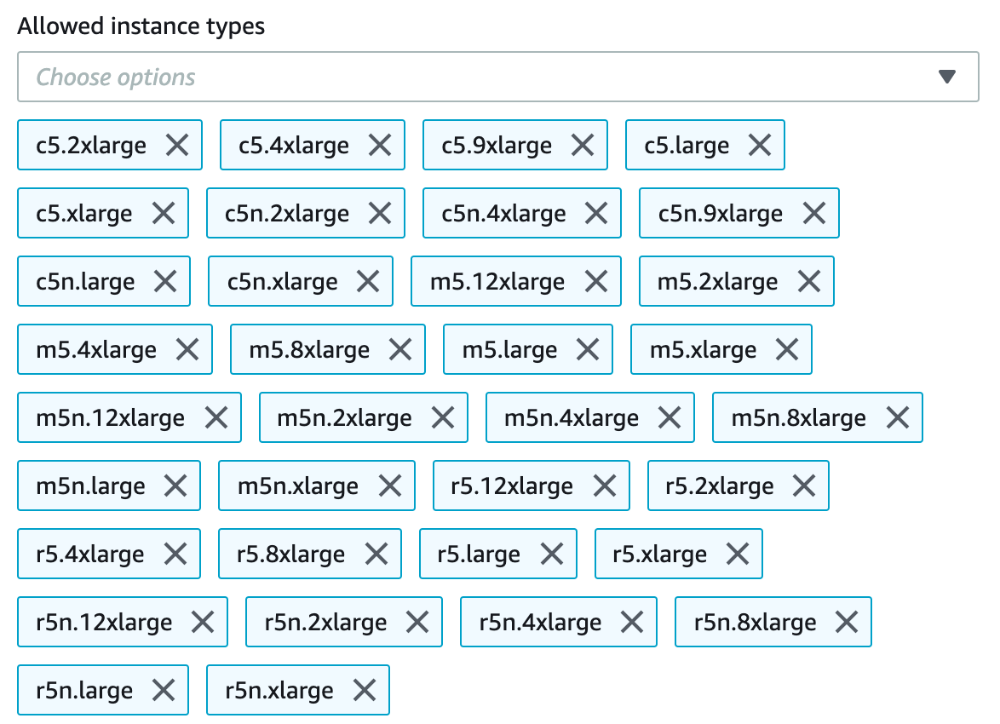
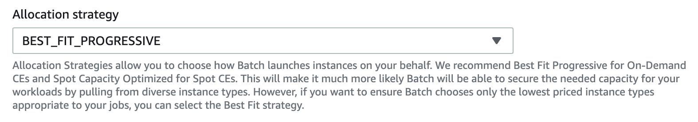
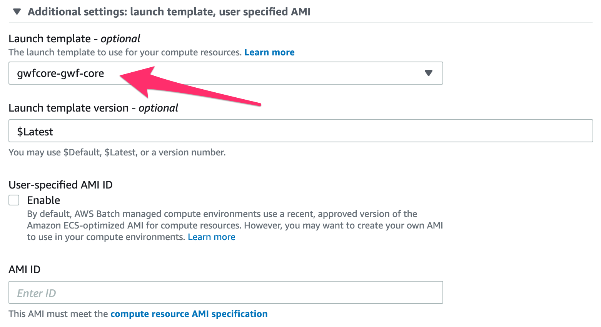
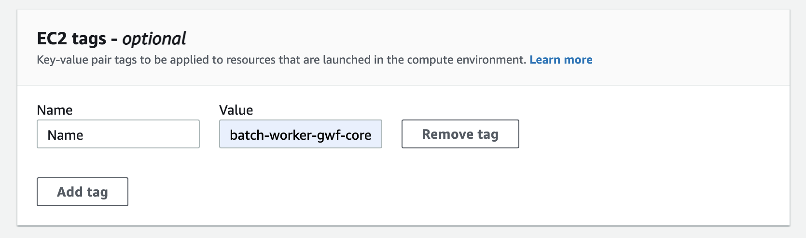
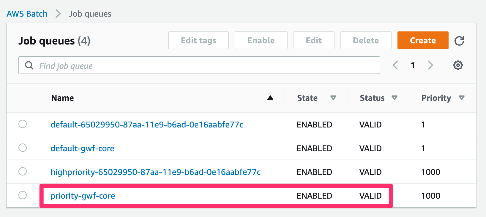
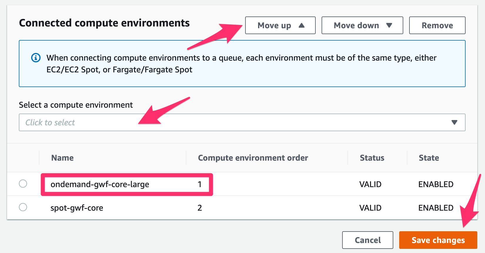

# How to Add Larger Instance Types

## Overview

1. Create a new compute environment in AWS Batch with additional EC2 instance types.
1. Associate the new compute environment to the priority job queue.
1. Remove the old compute environment.

To do this, you need to make some changes in `Job Queues` and `Compute Environments`.

## Clone the Existing Compute Environment

## Give New Name

## Set EC2 Keypair

Expand the option `Additional settings: service role, instance role, EC2 key pair`

## Add Additional Instance Types

- `c5.9xlarge`: 72.0 GiB / 36 vCPUs
- `c5n.9xlarge`: 96.0 GiB / 36 vCPUs
- `m5.8xlarge`: 128.0 GiB / 32 vCPUs
- `m5.12xlarge`: 192.0 GiB / 48 vCPUs
- `m5n.8xlarge`: 128.0 GiB / 32 vCPUs
- `m5n.12xlarge`: 192.0 GiB / 48 vCPUs
- `r5.8xlarge`: 256.0 GiB / 32 vCPUs
- `r5.12xlarge`: 384.0 GiB / 48 vCPUs
- `r5n.8xlarge`: 256.0 GiB / 32 vCPUs
- `r5n.12xlarge`: 384.0 GiB / 48 vCPUs

## Set Allocation Strategy

## Set Launch Template

Expand the option `Additional settings: launch template, user specified AMI`

## Set EC2 Tag

## Save

Click the `Create compute environment` button to save the changes.

## Add New Compute Environment to Priority Job Queue

Choose the queue that your new compute environment to be added to.

Select your new compute environment and make sure to move it to the top of the order so that it can be used before any other environment (or remove all other environments).

